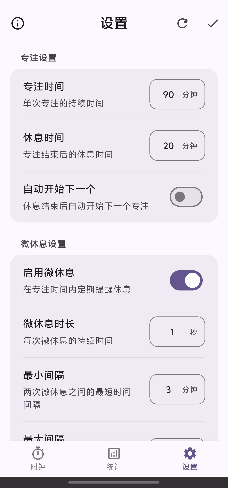
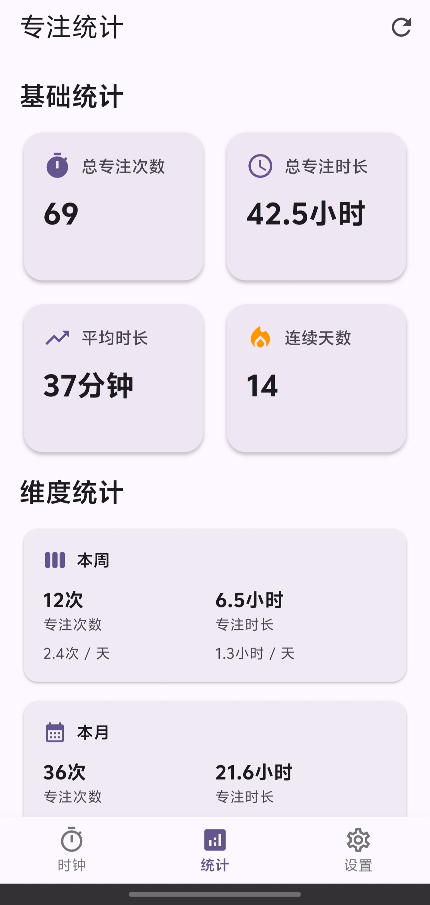

# TimeMachine — 基于 Flutter 的专注时钟应用

[Switch to English Version](README_EN.md)

**TimeMachine** 是一个简约高效的 Flutter 构建的专注时钟应用,  
计时机制, 灵感来源于B站视频[BV1naLozQEBq](https://www.bilibili.com/video/BV1naLozQEBq)

---

## 预览
**主页**  

<strong>禅模式</strong>

在主页点击中间的计时控件进入

<strong>设置</strong>

<strong>统计页面</strong>

---

## ✅ 主要功能

- 专注计时与动画进度展示
- 播放提示音
- 自定义专注时间, 休息时间, 微休息时间, 微休息间隔
- 自定义是否启用微休息, 正方向计时, 进度条方向
- 支持中断恢复
- 数据统计功能
- 禅模式 -- 计时页面点击页面中间的计时控件进行切换
- 仅支持 Android 平台

---

## 🎨 应用图标设计

图标由 [Gemini](https://gemini.google.com/) 生成

--- 

## ⏳️ 开发计划
- [x] 数据统计
- [x] 自动开始控制
- [ ] ~~自定义进度条颜色~~ 已放弃
- [x] 暗色模式
- [x] 禅模式
- [ ] 开关提示音
- [x] 后台保活(尽量...)  使用了 [FlutterBackgroundService](https://pub.dev/packages/flutter_background_service) 做了保活, 但不保证效果
- [ ] 多语言--英文
- [ ] 主页面返回键退出二次确认
- [ ] 数据备份

--- 

## 🙃 已知问题
- 底部小白条不能沉浸
- 亮色模式下进入禅模式会导致系统状态栏图标看不清(有解决思路, 但个人很喜欢因为这个bug产生的样式, 就先不修了)

---

## 📌 参考/鸣谢

- [BV1naLozQEBq](https://www.bilibili.com/video/BV1naLozQEBq)
- [JokerQianwei/Focus](https://github.com/JokerQianwei/Focus/)
- Gemini, Claude, ChatGPT

---

## License

本项目采用 **Creative Commons Attribution-NonCommercial 4.0 International License (CC BY-NC 4.0)** 开源。详情请参见 [LICENSE](LICENSE) 文件。

### 您可以：
- **分享** — 以任何媒介或格式复制、发行本作品
- **演绎** — 修改、转换或以本作品为基础进行创作

### 惟须遵守下列条件：
- **署名** — 您必须给出适当的署名，提供指向本许可协议的链接，同时标明是否（对原始作品）作了修改
- **非商业性使用** — 您不得将本作品用于商业目的

### 商业使用说明
如需商业使用本软件，请联系作者获取商业许可。个人学习、教育用途、非营利组织使用不受此限制。

---

## 打赏

如果你觉得这个项目对你有帮助, 可以考虑打赏

