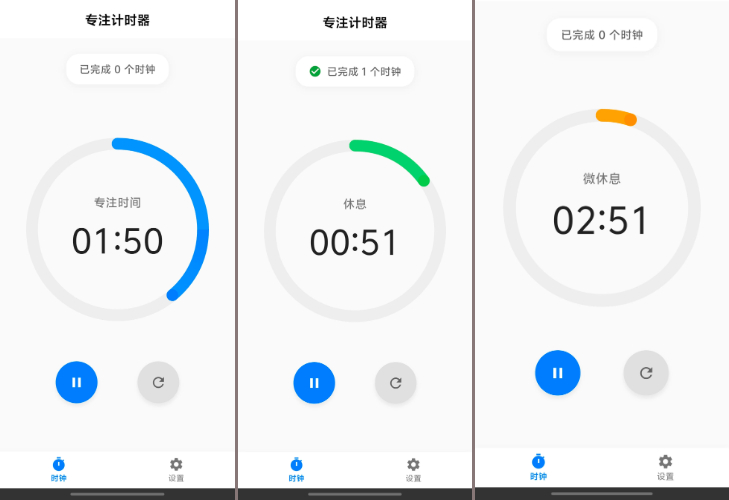

# TimeMachine — 基于 Flutter 的专注时钟应用

[Switch to English Version](README_EN.md)

**TimeMachine** 是一个简约高效的 Flutter 构建的专注时钟应用,  
计时机制, 灵感来源于B站视频[BV1naLozQEBq](https://www.bilibili.com/video/BV1naLozQEBq)

---

## 预览

---

## ✅ 主要功能

- 专注计时与动画进度展示
- 播放提示音
- 自定义专注时间, 休息时间, 微休息时间, 微休息间隔
- 自定义是否启用微休息, 正方向计时, 进度条方向
- 支持中断恢复
- 数据统计功能
- 禅模式 -- 计时页面点击页面中间的计时控件进行切换
- 仅支持 Android 平台

---

## 🎨 应用图标设计

图标由 [Gemini](https://gemini.google.com/) 生成

--- 

## ⏳️ 开发计划
- [x] 数据统计
- [x] 自动开始控制
- [ ] 自定义进度条颜色
- [x] 暗色模式
- [x] 禅模式
- [ ] 开关提示音
- [ ] 后台保活(尽量...)
- [ ] 多语言--英文

--- 

## 🙃 已知问题
- 底部小白条不能沉浸
- 亮色模式下进入禅模式会导致系统状态栏图标看不清(有解决思路, 但个人很喜欢因为这个bug产生的样式, 就先不修了)

---

## 📌 参考/鸣谢

- [BV1naLozQEBq](https://www.bilibili.com/video/BV1naLozQEBq)
- [JokerQianwei/Focus](https://github.com/JokerQianwei/Focus/)
- Gemini, Claude, ChatGPT