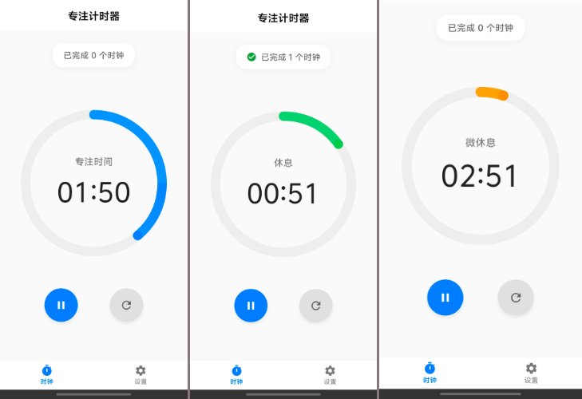
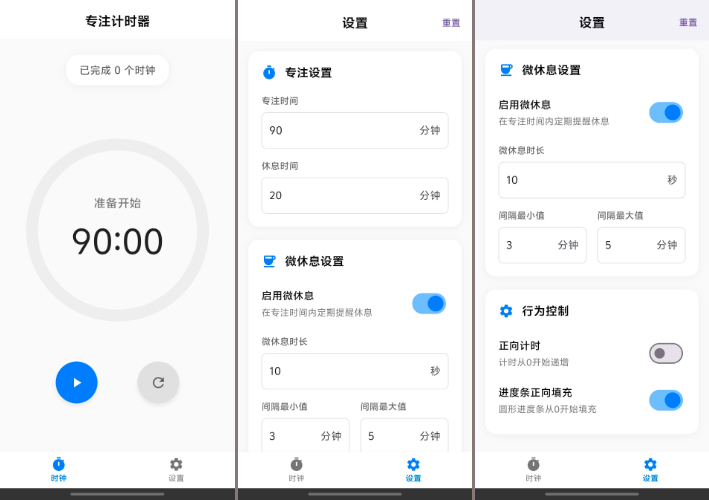

# TimeMachine — A Flutter Focus Timer App

[切换到中文版](README.md)

**TimeMachine** is a minimalist and efficient focus timer app built with Flutter.  
Its timing mechanism is inspired by this [Bilibili video](https://www.bilibili.com/video/BV1naLozQEBq).

---

## Preview
  

---

## ✅ Key Features

- Focus timer with animated progress display
- Notification sound playback
- Customizable durations for focus time, break time, micro breaks, and micro break intervals
- Toggle options for micro breaks, forward counting, and progress bar direction
- Support for session pause and resume
- Currently tested only on Android

---

## 🎨 App Icon Design

The icon was generated using [Gemini](https://gemini.google.com/)

---

## ⏳️ Roadmap

- [ ] Focus session statistics
- [x] Auto-start toggle
- [ ] Custom progress bar colors
- [ ] Dark mode
- [ ] Zen mode
- [ ] Toggle for notification sounds
- [ ] Background keep-alive (if possible...)
- [ ] Multi-language support — English

---

## 🙃 Known Issues

- Bottom navigation bar does not fully immerse

---

## 📌 References

- Timer mechanism: [BV1naLozQEBq](https://www.bilibili.com/video/BV1naLozQEBq)
- UI inspiration: [JokerQianwei/Focus](https://github.com/JokerQianwei/Focus/)
